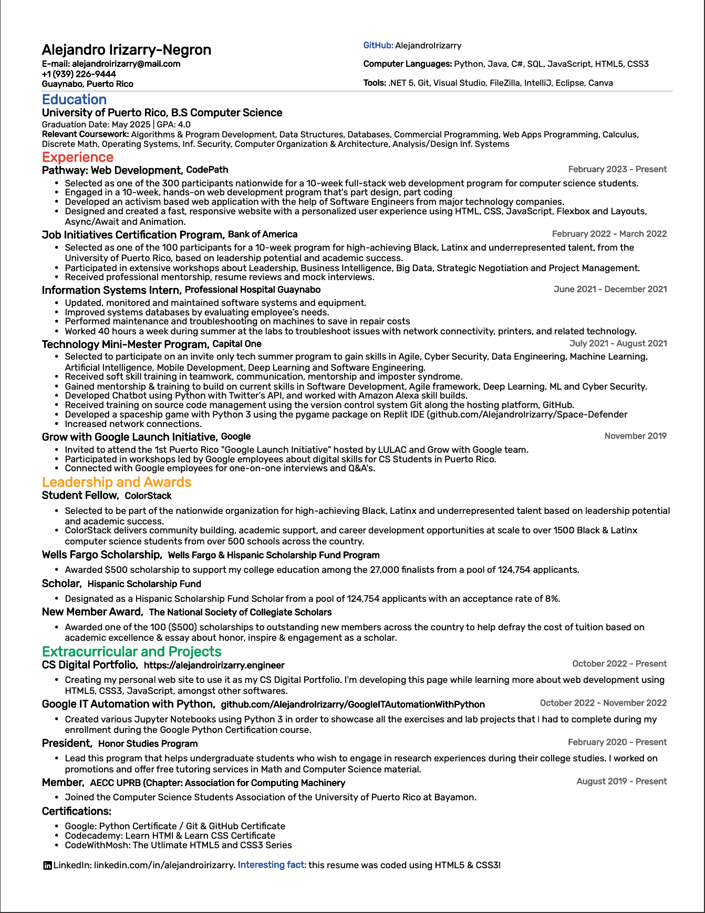

## OOGLEUME

Resume with a simple Google themed template 🚀

 

Resume Preview:

 

Copyright (©) - 2023 You may not copy, distribute, or modify this project without the express written consent of the author. If you would like to use this project as a template for your own website, please contact me at alejandroirizarry@programmer.net
